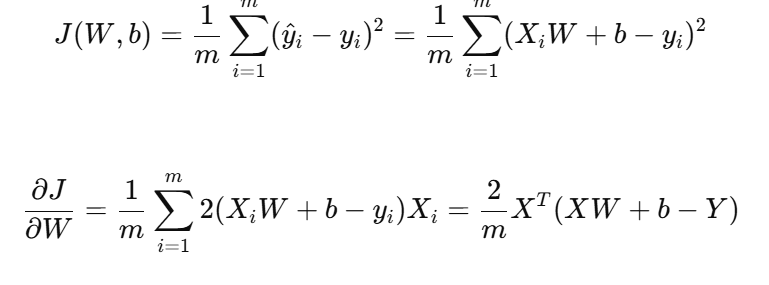
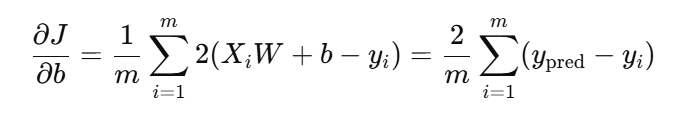

# Linear Regression

## What is Linear Regression?

Linear regression is a **simple supervised learning algorithm** used to model the relationship between a set of input features **X** and a continuous target variable **Y**.  
It tries to find a **linear function** that predicts Y from X.

Y ≈ X * W + b

Where:
- X — matrix of input features (samples × features)
- W — vector of weights
- b — bias (intercept)

# Example 

```python
import numpy as np

class LinearRegression:
    def __init__(self, n_dims, lr=0.01):
        # n_dims - number of features 
        self.lr = lr
        self.w = np.random.randn(n_dims, 1)
        self.b = 0

    def fit(self, X, Y, n_epoch=1000):
        Y = Y.reshape(-1, 1)  # Y - column
        for epoch in range(n_epoch):
            dw, db = self.grad(X, Y)
            self.w -= self.lr * dw
            self.b -= self.lr * db

    def predict(self, X):
        # self.w - column, (n_dim, 1)
        return np.dot(X, self.w) + self.b

    def grad(self, X, Y):
        m = X.shape[0]
        y_pred = self.predict(X)
        error = y_pred - Y
        dw = (1/m) * np.dot(X.T, error)
        db = (1/m) * np.sum(error)
        return dw, db
```

# How grads are calculated? 

For W:



For b:

